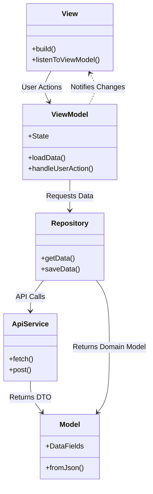

# Документация разработчика: Shift Manager CRM

## 1. Обзор проекта
**Shift Manager CRM** — это кроссплатформенное Flutter приложение для управления персоналом и планирования рабочих смен. Приложение позволяет менеджерам составлять графики, отслеживать конфликты в расписании, управлять базой сотрудников и просматривать аналитику.

### Основные возможности
*   **Аутентификация:** Вход в систему (Mock-авторизация).
*   **Дашборд:** Сводная статистика, уведомления о днях рождения и проблемах в расписании.
*   **Управление графиком:** Календарь смен (день/неделя/месяц), Drag & Drop редактирование, создание смен.
*   **Валидация:** Автоматическая проверка конфликтов (наложения, переработки, недостаток отдыха).
*   **База сотрудников:** Табличный просмотр, фильтрация, поиск, редактирование профилей.

---

## 2. Технологический стек

*   **Фреймворк:** Flutter (Dart SDK ^3.8.0).
*   **Архитектура:** MVVM (Model-View-ViewModel) + Clean Architecture.
*   **Управление состоянием:** Native `ValueNotifier` / `ChangeNotifier`.
*   **Внедрение зависимостей (DI):** Кастомный Service Locator (`ModuleLocator`).
*   **Навигация:** Кастомная реализация Navigator 2.0 (Router API).
*   **UI Компоненты:**
    *   `syncfusion_flutter_calendar` — для отображения графика.
    *   `syncfusion_flutter_datagrid` — для таблиц сотрудников.
    *   Material 3 Design.
*   **Сеть:** Пакет `http` с кастомной абстракцией и интерцепторами.

---

## 3. Архитектура приложения

Проект следует принципам разделения ответственности. Поток данных однонаправленный.


[Edit in Mermaid Playground](https://www.mermaidchart.com/play#pako:eJx1U8FuAiEQ_RXCqU3UmPa2t63apE1sG7WevEyXUUnZxcJgY4z_XhC1KMplYebNe8NbZssrLZAXvFJgbV_CwkA9a5hf-wibSvxl2xgJa-a63YenLyeVuLu_DCtpCZuJDkVDz6uOkN0l5T6b844JCMP2sVfaTVNNQbl4HmRaGkQfCPIultAIhZ8WTVmR1M3VJka40laSNpu8iwXSdWYLa0wzZ4zlSo7RrGWFOeMcqVrmfL4Fusp1w56g_SxRCZsJGF2_2rO7xs3-_7Xb0cPE-oIFg1h0yP5jY7bTSQo89k2TnEu0rOfNXWCGPwkkthb-8OPQkmWh71iS5E81iXEFKz9eWA-UOkgkuRP-eIERkjONZ5-83ybPwLoG2cQwb_EajT8LXmw5LbEOkyDAfPNdi4MjPfZvkBdkHLa4Wwn_OA8jwos5KOujKILg8DBE4bP7A6oXBIs=)


### Слои приложения
1.  **Presentation Layer (UI):**
    *   **Views:** Экраны (`ScheduleView`, `DashboardView`). Пассивны, отображают данные из VM.
    *   **Widgets:** Переиспользуемые компоненты (`ConflictWarningBox`, `SummaryBar`).
2.  **Logic Layer (ViewModel):**
    *   Управляют состоянием экрана.
    *   Используют `AsyncValue` для обработки состояний загрузки/ошибки/данных.
    *   Пример: `ScheduleViewModel`, `EmployeeSyncfusionViewModel`.
3.  **Domain Layer (Repositories):**
    *   Изолируют бизнес-логику от источников данных.
    *   Пример: `ShiftRepository`, `EmployeeRepository`.
4.  **Data Layer (Services & Models):**
    *   `ApiService`: Абстракция для работы с сетью.
    *   `MockApiService`: Генерация тестовых данных.

---

## 4. Ключевые модули и функциональность

### 4.1. Модуль Расписания (`lib/schedule`)
Центральная часть приложения.

*   **Визуализация:** Использует `SfCalendar`. Поддерживает режимы просмотра: День, Неделя (Timeline), Месяц.
*   **Drag & Drop:** Реализовано перетаскивание смен для изменения времени или назначения на другого сотрудника.
*   **Фильтрация:**
    *   По сотруднику, должности, филиалу.
    *   Пресеты: "Мои смены", "С конфликтами", "Незаполненные".
*   **Валидация (Conflict Checker):**
    Класс `ShiftConflictChecker` (`lib/schedule/utils/shift_conflict_checker.dart`) проверяет:
    *   `timeOverlap`: Наложение смен по времени.
    *   `insufficientRest`: Отдых между сменами менее 8 часов.
    *   `tooManyShiftsPerDay`: Более 2 смен в день.
    *   `locationConflict`: Сотрудник в разных местах одновременно.
    *   Разделяет конфликты на **Hard Errors** (блокируют сохранение) и **Warnings** (требуют подтверждения).

### 4.2. Модуль Сотрудников (`lib/employees_syncfusion`)
Управление базой персонала.

*   **Таблица:** Использует `SfDataGrid` для отображения списка с колонками: Имя, Должность, Филиал, Статус, Отработано часов.
*   **Источник данных:** `EmployeeDataSource` адаптирует модели для грида.
*   **Функции:** Поиск, фильтрация, удаление, создание сотрудника.

### 4.3. Модуль Дашборда (`lib/dashboard`)
Стартовый экран с аналитикой.

*   **Статистика:** `DashboardStats` (всего сотрудников, смены сегодня, часы за неделю).
*   **Алерты:** Уведомления о запросах на выходной или нехватке персонала на пятницу.
*   **Дни рождения:** Список ближайших именинников.

### 4.4. Навигация (`lib/core/utils/navigation`)
В проекте реализована собственная система навигации на базе **Navigator 2.0**, без использования сторонних пакетов (как go_router).

*   **`RouterService`:** ViewModel для навигации. Хранит стек страниц (`_navigationStack`). Методы: `goTo`, `replace`, `back`.
*   **`AppRouterDelegate`:** Отвечает за построение стека страниц Flutter на основе данных из `RouterService`.
*   **`RouteConfig`:** Определяет карту маршрутов и права доступа (`requiresAuth`).

---

## 5. Работа с данными (Data Layer)

### 5.1. Mock API Service
В текущей версии используется `MockApiService` (`lib/data/services/mock_api_service.dart`), который эмулирует бэкенд.

*   **Генерация данных:** При старте генерирует ~50 сотрудников с реалистичными именами и аватарами (через сервис ui-avatars.com).
*   **Генерация смен:** Создает расписание на текущий месяц, учитывая должности и правила непересечения.
*   **Задержка:** Имитирует сетевую задержку (`Future.delayed`) для проверки UI лоадеров.

### 5.2. Dependency Injection
Используется кастомный Service Locator в файле `lib/core/utils/locator.dart`.
Регистрация модулей происходит в `lib/config/locator_config.dart`:

```dart
final modules = [
  Module<RouterService>(builder: () => RouterService(...), lazy: false),
  Module<AuthRepository>(builder: () => AuthRepository(...), lazy: true),
  // ... другие сервисы
];
```

---

## 6. Инструкция по запуску и разработке

### Требования
*   Flutter SDK: `^3.8.0`
*   Dart SDK: Совместимый с Flutter 3.8+

### Установка
1.  Клонировать репозиторий.
2.  Выполнить `flutter pub get`.
3.  Запустить проект `flutter run`.

### Учетные данные для входа (Mock)
*   **Email:** `admin@example.com`
*   **Пароль:** `password123`

### Структура папок
```text
lib/
├── auth/           # Экран логина и VM
├── config/         # Конфигурация роутинга и DI
├── core/           # Базовые утилиты (UI кит, навигация, DI, ошибки)
├── dashboard/      # Экран дашборда
├── data/           # Репозитории, модели, API сервисы
├── employees_syncfusion/ # Экран списка сотрудников
├── schedule/       # Экран календаря и логика смен
├── startup/        # Логика инициализации приложения
└── main.dart       # Точка входа
```

---

## 7. Известные ограничения и TODO
1.  **Хранение данных:** Все данные хранятся в оперативной памяти (`MockApiService`). При перезапуске приложения изменения теряются.
2.  **Локализация:** Подключен пакет `intl`, инициализирована русская локаль, но строки в коде в основном захардкожены на русском языке.
3.  **Тесты:** В структуре есть папка `test`, но в предоставленном контексте примеры тестов отсутствуют. Рекомендуется покрытие Unit-тестами `ShiftConflictChecker`.


# API Specification for Shift Manager CRM

## 1. Общие требования

*   **Base URL:** `https://api.shiftmanager.com/v1` (конфигурируется в приложении).
*   **Формат обмена данными:** JSON.
*   **Кодировка:** UTF-8.
*   **Формат даты и времени:** ISO 8601 (`YYYY-MM-DDTHH:mm:ss.sss`), например `2023-10-25T09:00:00.000`.
*   **Обработка ошибок:** HTTP коды (200 OK, 400 Bad Request, 401 Unauthorized, 404 Not Found, 500 Internal Server Error).

## 2. Аутентификация

Приложение ожидает, что после успешного входа будет получен объект пользователя.
*Примечание: В текущей реализации токен не передается явно в методах, но подразумевается использование `Authorization: Bearer <token>` в заголовках через интерцептор.*

### Login
**POST** `/auth/login`

**Request Body:**
```json
{
  "username": "admin",
  "password": "password123"
}
```

**Response Body (200 OK):**
```json
{
  "user": {
    "id": "user_1",
    "username": "admin",
    "role": "administrator" // см. раздел Enums
  },
  "token": "eyJhbGciOiJIUz..." // Токен для последующих запросов
}
```

### Logout
**POST** `/auth/logout`
*Заголовки: Authorization required*

---

## 3. Сотрудники (Employees)

### Получить всех сотрудников
**GET** `/employees`

**Response Body:**
```json
[
  {
    "id": "emp_1",
    "first_name": "Иван",
    "last_name": "Иванов",
    "position": "Кассир",
    "branch": "ТЦ Мега",
    "status": "active",
    "hire_date": "2022-01-15T00:00:00.000",
    "avatar_url": "https://...",
    "email": "ivan@example.com",
    "phone": "+7 (900) 123-45-67",
    "birthday": "1990-05-20T00:00:00.000",
    "desired_days_off": [
      {
        "date": "2023-11-01T00:00:00.000",
        "comment": "День рождения"
      }
    ]
  }
]
```

### CRUD операции
*   **GET** `/employees/{id}` — Получить одного сотрудника.
*   **POST** `/employees` — Создать (Body аналогичен JSON выше, без `id`).
*   **PUT** `/employees/{id}` — Обновить.
*   **DELETE** `/employees/{id}` — Удалить (архивировать).

---

## 4. Смены (Shifts)

### Получить смены (с фильтрацией)
**GET** `/shifts`

**Query Parameters:**
*   `start`: ISO Date (опционально) — начало периода.
*   `end`: ISO Date (опционально) — конец периода.
*   `employee_id`: String (опционально) — фильтр по сотруднику.

**Response Body:**
```json
[
  {
    "id": "shift_101",
    "employee_id": "emp_1",
    "location": "ТЦ Мега",
    "start_time": "2023-10-25T09:00:00.000",
    "end_time": "2023-10-25T18:00:00.000",
    "status": "confirmed",
    "notes": "Важная смена",
    "is_night_shift": false,
    "employee_preferences": "Предпочитаю утро",
    "role_title": "Кассир",
    "hourly_rate": 400.0
  }
]
```

### CRUD операции
*   **GET** `/shifts/{id}`
*   **POST** `/shifts`
*   **PUT** `/shifts/{id}`
*   **DELETE** `/shifts/{id}`

---

## 5. Справочники (Dictionaries)

Приложение запрашивает списки доступных значений для выпадающих списков.

### Филиалы
**GET** `/dictionaries/branches` (или аналогичный endpoint, в коде абстрагировано)
**Response:** `["ТЦ Мега", "Центр", "Аэропорт"]`

### Роли/Должности
**GET** `/dictionaries/roles`
**Response:** `["Уборщица", "Кассир", "Повар", "Менеджер"]`

---

## 6. Справочник значений (Enums & Constants)

Для корректной работы логики приложения (цветовая индикация, иконки) бэкенд должен возвращать следующие строковые значения (case-sensitive):

### Статусы смены (`status`)
| Значение | Описание | Цвет в UI |
| :--- | :--- | :--- |
| `pending` | Ожидает подтверждения | 🟡 Amber |
| `confirmed` | Подтверждена | 🔵 Blue |
| `cancelled` | Отменена | ⚪ Grey |

### Статусы сотрудника (`status`)
| Значение | Описание |
| :--- | :--- |
| `active` | Работает |
| `vacation` | В отпуске |
| `sick_leave` | На больничном |

### Роли пользователей (`role`)
| Значение | Права доступа |
| :--- | :--- |
| `administrator` | Полный доступ |
| `manager` | Управление сменами |
| `employee` | Только просмотр |

---

## 7. Интеграция на стороне Flutter

Чтобы переключить приложение с Mock на реальный API, разработчику мобильного приложения нужно сделать два изменения:

1.  **Обновить Base URL:**
    В файле `lib/core/constants/api_endpoints.dart`:
    ```dart
    static const String baseUrl = 'https://your-production-api.com'; // Изменить здесь
    ```

2.  **Заменить Mock-сервис на Реальный:**
    В файле `lib/config/locator_config.dart` нужно заменить реализацию `ApiService`.

    *Было:*
    ```dart
    Module<ApiService>(
      builder: () => MockApiService(),
      lazy: false,
    ),
    ```

    *Станет (нужно создать файл `lib/data/services/http_api_service.dart`):*
    ```dart
    Module<ApiService>(
      builder: () => HttpApiService(
        http: locator<HttpAbstraction>(), // Используем уже настроенный HTTP клиент
      ),
      lazy: false,
    ),
    ```

### Пример реализации `HttpApiService` (для справки)

```dart
class HttpApiService implements ApiService {
  final HttpAbstraction _http;

  HttpApiService({required HttpAbstraction http}) : _http = http;

  @override
  Future<List<Employee>> getEmployees() async {
    final response = await _http.get(Uri.parse(ApiEndpoints.employees));
    if (response.statusCode == 200) {
      final List data = json.decode(response.body);
      return data.map((e) => Employee.fromJson(e)).toList();
    }
    throw Exception('Failed to load employees');
  }
  
  // Реализация остальных методов интерфейса ApiService...
}
